---

 

# Hour Logger App

## App Description
The hour logger app is a cross-platform app that allows a user to join or create an organization to which they can then log their work hours every day. This idea came to me out of necessity for a job in which the way the hours worked were being tracked was unecessarily hard.

## Technologies used

This app was made using Flutter and making use of firebase for authentication and database purposes.

### Pictures

    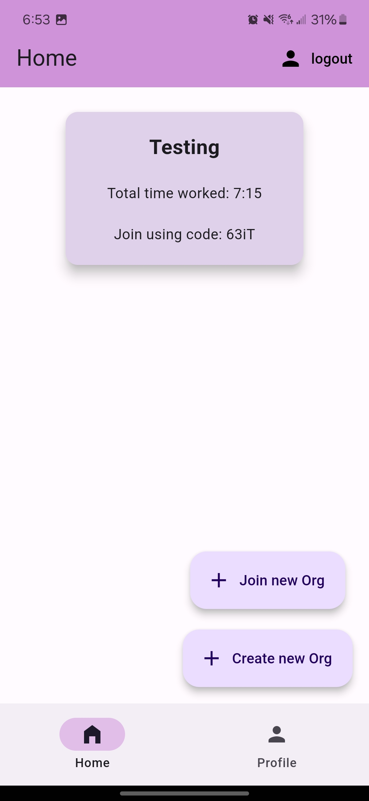
    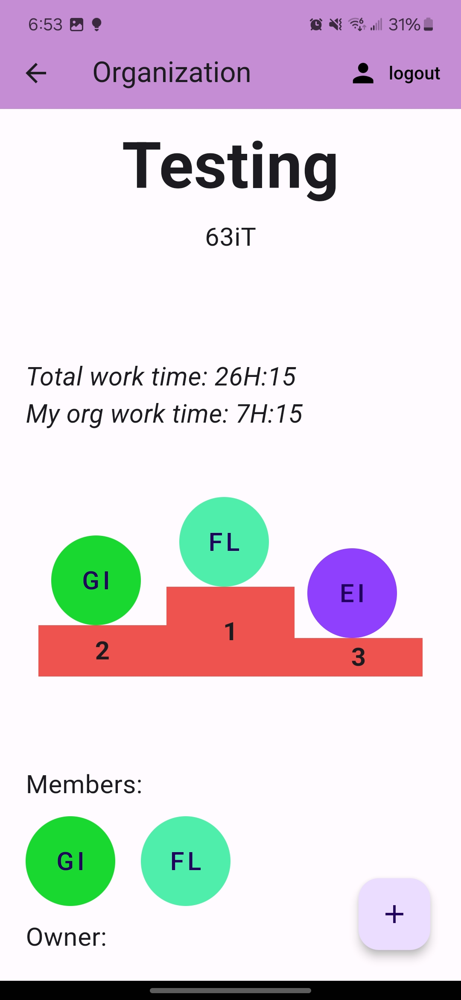
    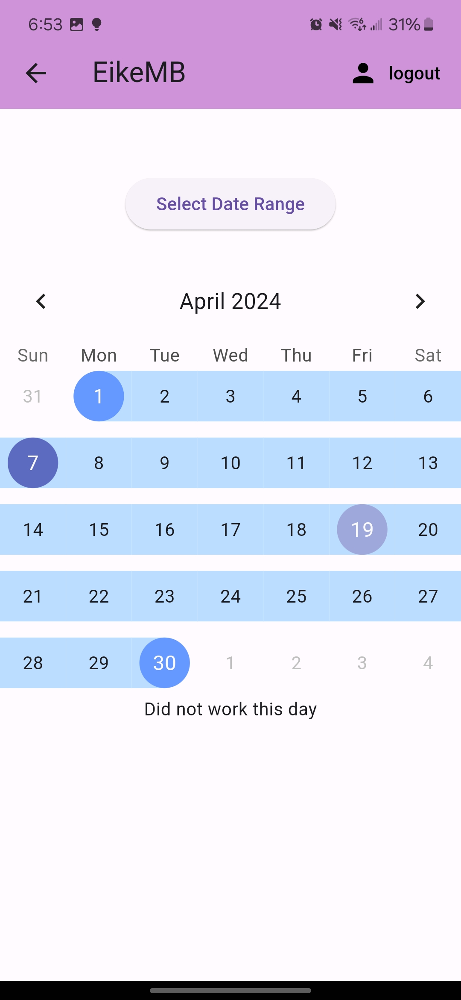
    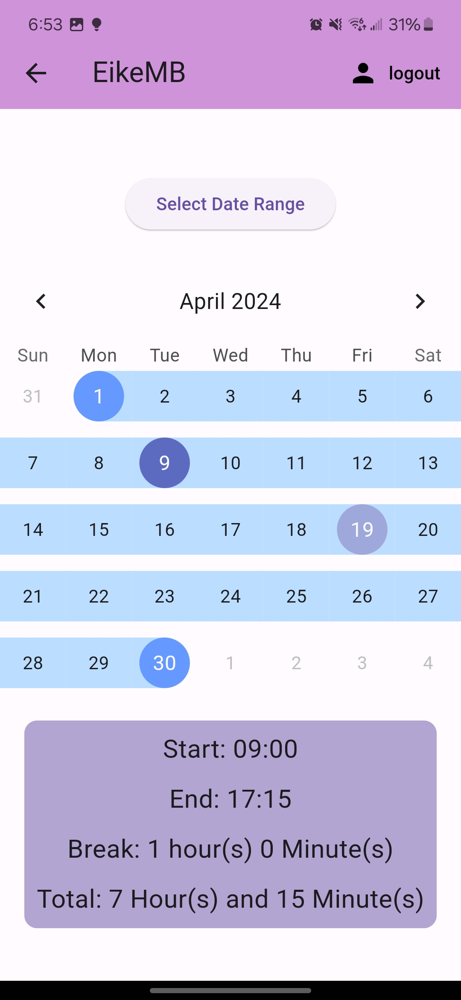
    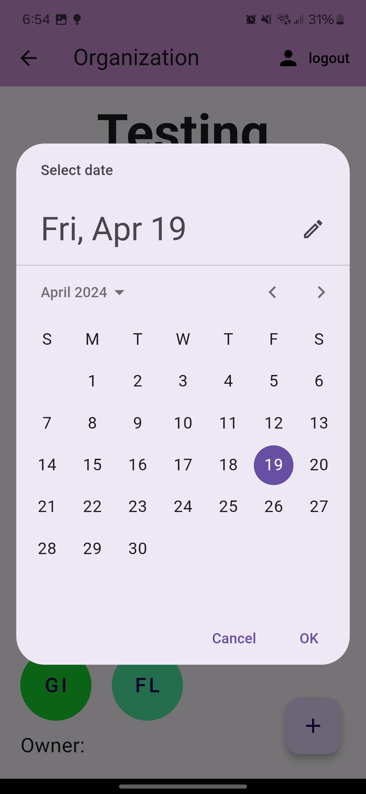
    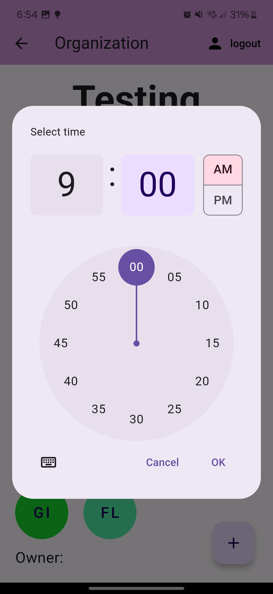
    
    
    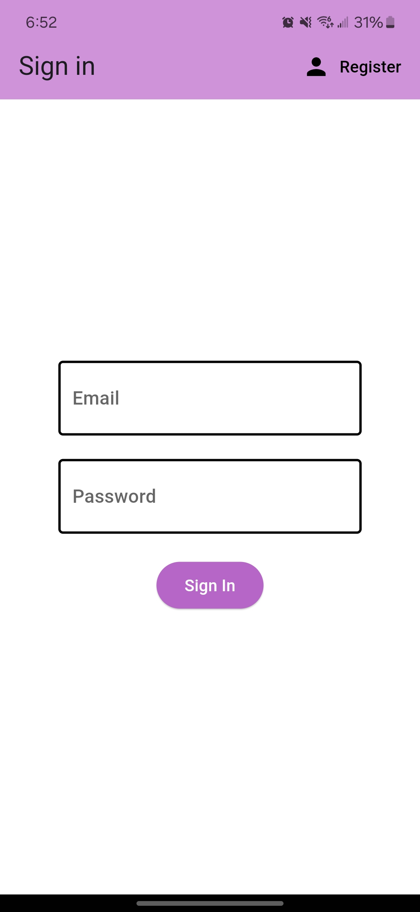
    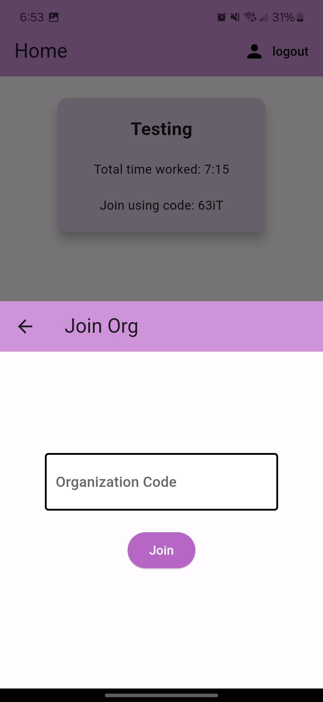

[View Project on Github](https://github.com/EikeMB/mobileHoursManager)

# Car Builder App

## App Description
The Car Builder App is an interactive and user-friendly tool that empowers users to customize and visualize their dream cars. Whether you are a car enthusiast or someone looking to explore various car configurations, this app provides a seamless and engaging experience.

## Technologies used

This app was made using kotlin and the jetpack compose developpment toolkit.

### Pictures

    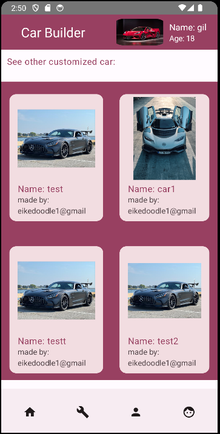
    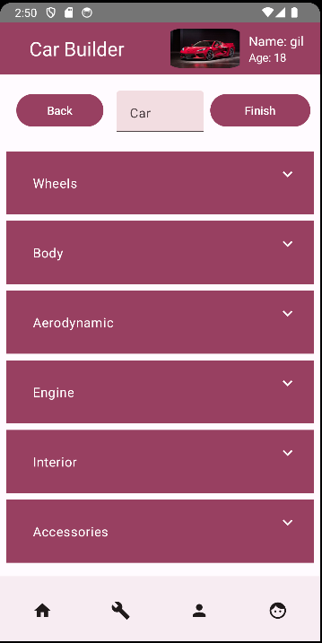
    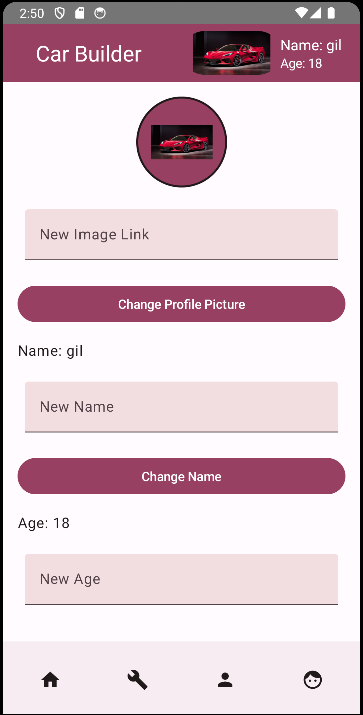
    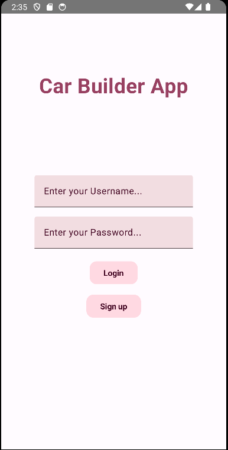
    

[View Project on Github](https://github.com/EikeMB/AppDev2_Project)

---
 
 

# Hour Tracking Application 🕒

## App Description

A windows desktop app that allows the user to add and track hours they have worked. 

The inspiration to create this application came when at my summer job there was no good way to keep track of hours as there was no clocking in method used. 

This project was more of a proof of concept for me to see if I should spend time making it into a mobile app.

## Technologies used

This app makes use of C# WPF and SQL for the database connections.

### Pictures

    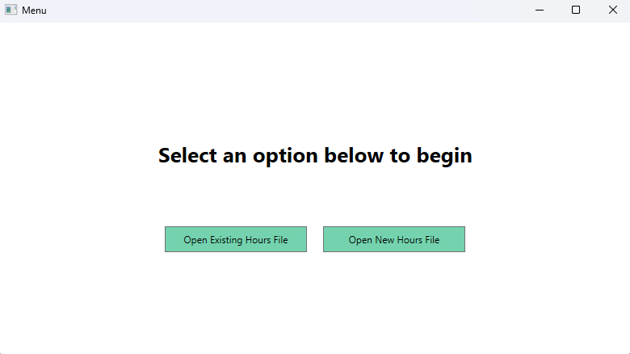
    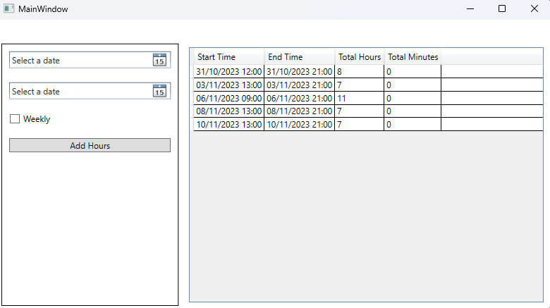
    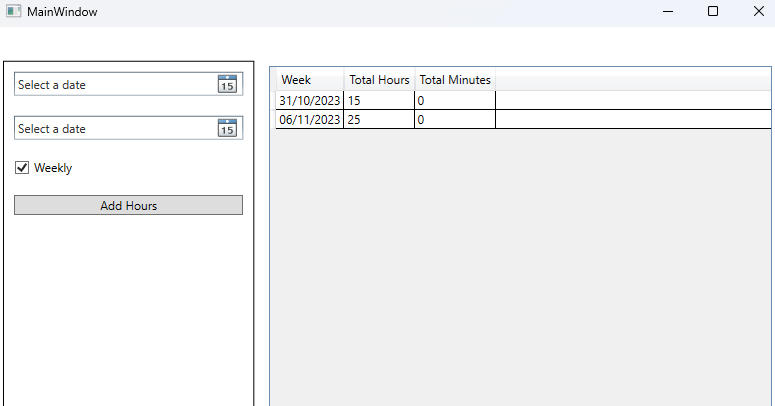
    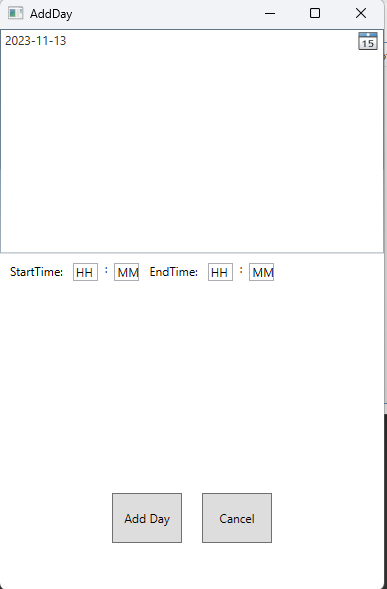

[View Project on Github](https://github.com/EikeMB/HoursManaging)

---

 
 

# Fruit Reviewing Website 🍓

## Website description

A web application that has a collection of fruits. Users must sign in and can then review the fruits and look at the review of others.

This project was a school project that I did with another person for a web programming class. The inspiration for it came about when me and the other person would always argue about what fruits were the best.

## Technologies used

This web app was made using node.js for the server side, mongoDb for the database, and React for the frontend.

### Pictures

    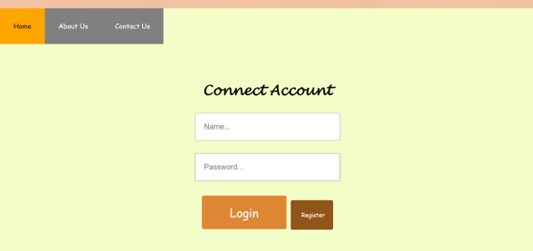
    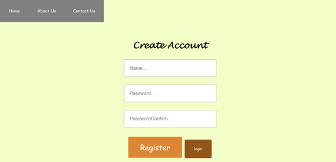
    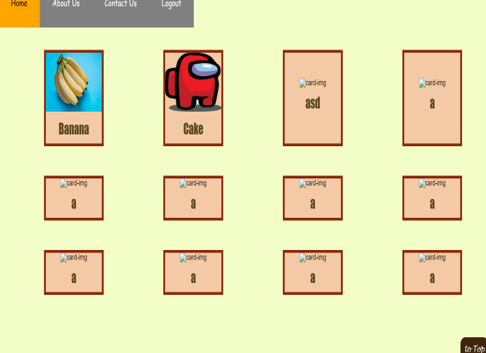
    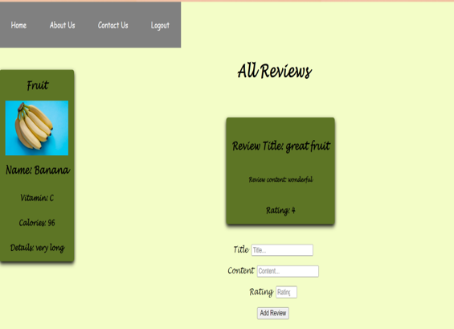

[View Project on Github](https://github.com/EikeMB/web2FruitProject)